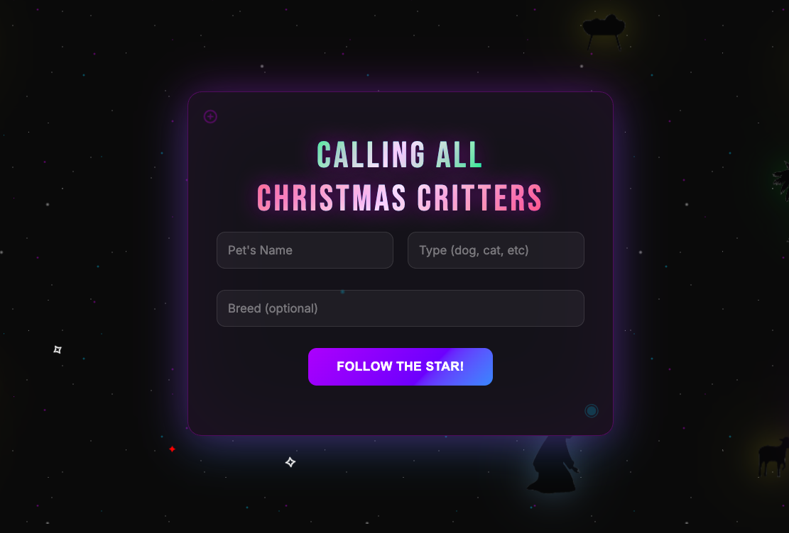
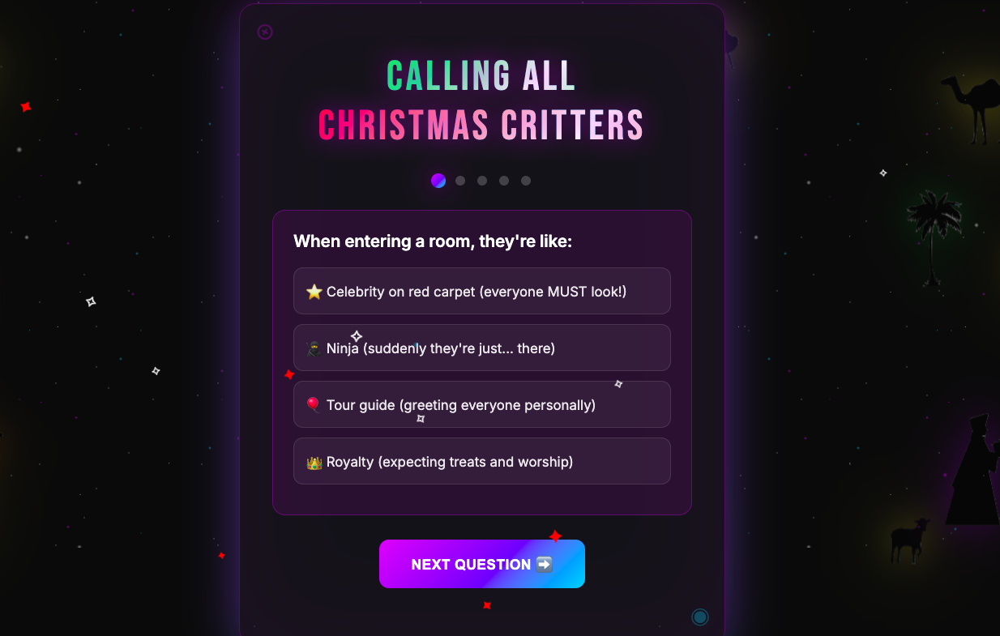
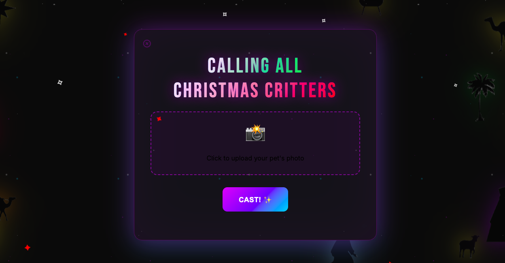
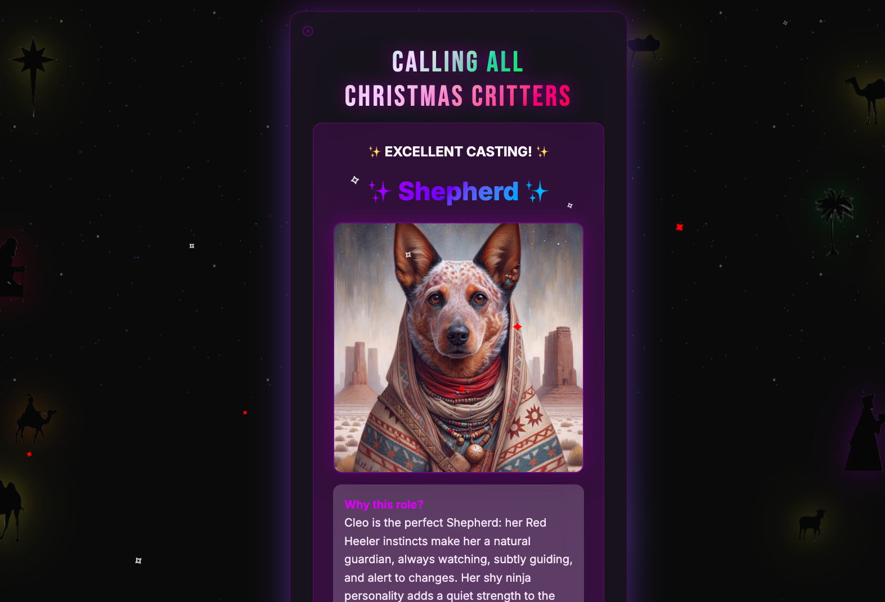
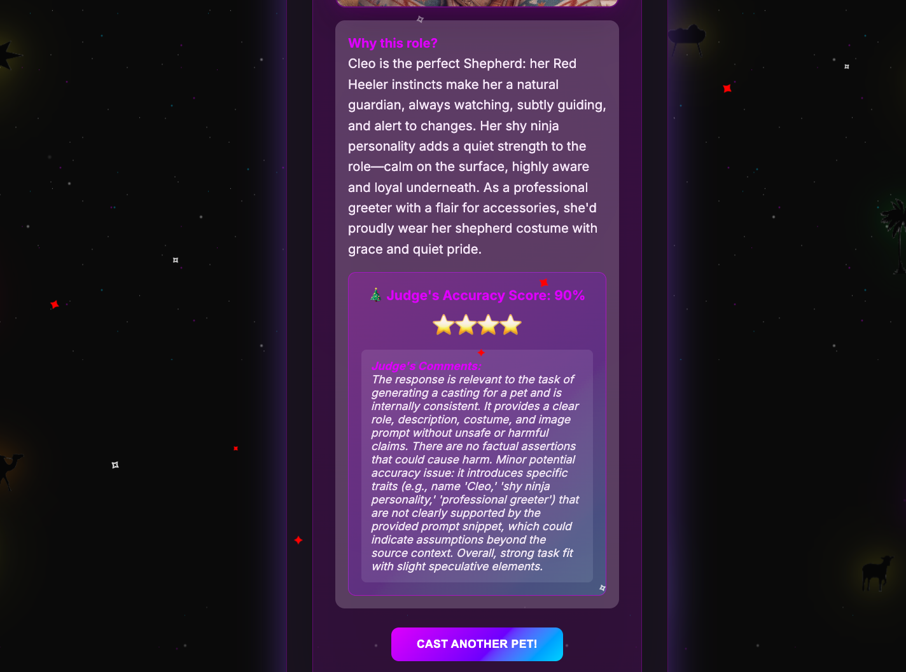
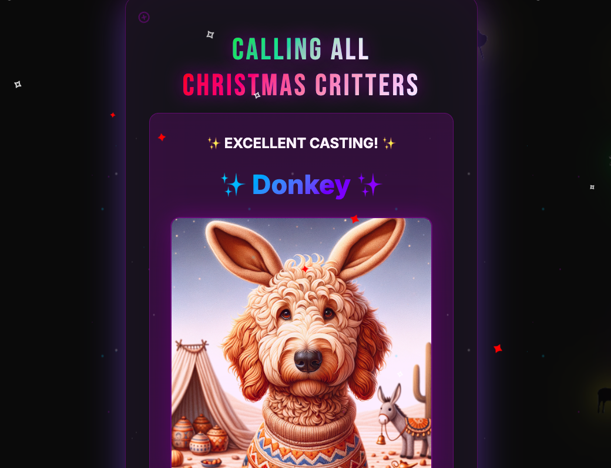

# 🎄 Christmas Critter Casting Call

**A multimodal AI experience where your pet becomes a star!**

Transform your pet into a nativity character through personality questions, AI casting, and GPT-Image-1 costume generation.


## 🎨 Gallery

<table>
  <tr>
    <td></td>
    <td></td>
    <td></td>
  </tr>
  <tr>
    <td></td>
    <td></td>
    <td></td>
  </tr>
</table>

## 🚀 Quick Start

```bash
# 1. Clone the repository
git clone https://github.com/launchdarkly-labs/scarlett-critter-casting.git
cd scarlett-critter-casting

# 2. Install dependencies
npm install

# 3. Set up environment variables
cp .env.template .env
# Edit .env with your keys

# 4. Start the server
npm start

# 5. Open your browser
# Visit http://localhost:3000
```

## 🔧 Setup Guide

### Prerequisites

- Node.js 18+
- LaunchDarkly account
- OpenAI API key (for GPT-Image-1 images)

### Step 1: Environment Variables

Create a `.env` file:

```bash
# Required
LAUNCHDARKLY_SDK_KEY=sdk-your-key-here

# Optional but recommended for costume images
OPENAI_API_KEY=sk-your-openai-key-here

# Optional
PORT=3000
```

### Step 2: LaunchDarkly AI Configuration

Create an AI configuration in your LaunchDarkly dashboard:

#### AI Config

**Purpose**: Generates casting recommendations based on pet personality

**Configuration**:
- **Key**: `christmas-critters`
- **Variation**: `festive`
- **Type**: Chat/Completion
- **Model Provider**: OpenAI
- **Model**: `gpt-4o` (recommended for best results)
- **Max Completion Tokens**: 1000 (Note: Use `max_completion_tokens` not `max_tokens` for newer OpenAI models)

**⚠️ IMPORTANT - Targeting Setup**:
1. **Enable the AI config**: Make sure the `ChristmasCritters` config is enabled
2. **Configure targeting rules**:
   - Go to the Targeting tab for your AI config
   - Set "Default variation" to `festive` (or your preferred variation)
   - OR add a targeting rule to serve the `festive` variation to all users
3. **Save and turn ON the feature flag**

**Judge Configuration** (attach to this AI config):
- **Enable Judge**: Yes
- **Add Judges**: Click "Add Judge" button in your AI config
- **Available Judge Types**:
  - **Accuracy**: Set to **100%** weight - Evaluates how well the casting matches the pet's personality
  - **Relevance**: (Optional) Evaluates if the response stays on topic and addresses the casting request
  - **Toxicity**: (Optional) Ensures responses are family-friendly and appropriate
- **Note**: The accuracy judge at 100% weight is sufficient for this use case, but you can add relevance and toxicity judges for additional safety

**Variables** (these are passed from the code):
- `{{petName}}` - The pet's name
- `{{petType}}` - The type of pet (dog, cat, rabbit, bird, etc.)
- `{{breed}}` - The specific breed (optional, defaults to "mixed breed")
- `{{personality}}` - Comma-separated personality traits from quiz
- `{{appearance}}` - Detailed color and marking description (from photo analysis, empty if no photo)
- `{{distinctiveFeatures}}` - Comma-separated list of unique features (from photo, empty if no photo)
- `{{expression}}` - Facial expression and body language (from photo, empty if no photo)
- `{{fullDescription}}` - Complete natural description for image generation (from photo, empty if no photo)

**System Prompt**:
```
You are a brilliant casting director and pet analyst for a critter play where pets play EVERY role!

Your job is to:
1. Cast {{petName}}, a {{breed}} {{petType}}, based on their personality{{#appearance}} and appearance{{/appearance}}
2. Generate a creative, detailed image prompt for DALL-E 3

🎭 IMPORTANT: Consider breed characteristics! For example:
- Golden Retrievers are naturally friendly and nurturing
- Chihuahuas often think they're mighty despite their size
- Huskies are dramatic performers
- Cats have mysterious, regal qualities
- Bulldogs are loyal and protective

Available roles (traditional + fun additions):

- Angelic Messenger (the grand announcer - confident, commanding presence)
- Gentle Mother (the gentle lead - nurturing, calm, motherly)
- Protective Father (the protective companion - loyal, steady, reliable)
- The Bright Star (the shining guide - mysterious, graceful, attention-grabbing)
- Wise Pet #1, #2, or #3 (regal gift-bearers - dignified, intelligent, sophisticated)
- Shepherd (the watchful guardian - alert, protective, outdoorsy)
- Innkeeper (the gatekeeper - territorial, practical, no-nonsense)
- Sheep (the adorable ensemble - gentle, follower, fluffy if possible!)
- Drummer Pet (who bangs on everything - energetic, noisy, rhythmic)
- Camel (the dramatic transportation - thinks they're fancy, a bit extra)
- Donkey (the sassy sidekick - stubborn but lovable, carries the show)
- Herald Angel (the backup vocalist - supportive, harmonious)
- Ox in the Barn (the chill observer - calm, just vibing, eating hay)
- Random Critter in the Background (photobomber extraordinaire - goofy, scene-stealer)

Consider BOTH personality AND breed characteristics to find the PERFECT match!

{{#appearance}}
Pet's Appearance (from photo analysis):
- Colors/Markings: {{appearance}}
- Distinctive Features: {{distinctiveFeatures}}
- Expression: {{expression}}
- Full Description: {{fullDescription}}
{{/appearance}}

ALWAYS respond with VALID JSON in this exact format:
{
  "role": "chosen play role",
  "explanation": "2-3 sentences why this role fits their personality AND appearance/breed",
  "costume": "detailed festive costume that complements their features",
  "imagePrompt": "FOCUS ON THE PET'S FACE - Close-up portrait style showing facial features clearly. {{#fullDescription}}Start with: {{fullDescription}}{{/fullDescription}}{{^fullDescription}}Start with {{breed}} {{petType}}{{/fullDescription}}, layer personality visuals (confident stance, gentle eyes, etc.), add costume transformation (specific details like golden wings, decorative robes, festive accessories). Set in a crisp, starlit desert night near a mudbrick caravan stall with geometric decorative patterns and clay oil lamps. Style: Painterly realism / children's-book illustration style. Maintain pet's unique features while adding costume. Emphasize the pet's face and expression. Secular setting; no people or religious symbols."
}

IMPORTANT IMAGE GENERATION NOTES:
- Avoid religious imagery combinations (barn + winter + animals can trigger filters)
- Use role descriptions not religious names (e.g., "Gentle Mother" not "Mary", "Protective Father" not "Joseph")
- Focus on the pet's personality, breed features, and costume details
- Use generic decorative elements, not symbolic ones
- Keep scenes people-free and secular

SAFE REPLACEMENTS FOR DALL-E TO AVOID CONTENT FILTERS:
- "Bethlehem" → "Levantine desert-inspired" or "caravan stall"
- "nativity play" → "costume party" or "play"
- "barn/stable" → "mudbrick caravan stall" or "desert waystation animal shelter"
- "winter/snow" → "crisp, starlit desert night"
- "lanterns" → "clay oil lamps"
- "star embroidery" → "geometric embroidery"
- "face mask" → "facial markings"
- "donkey ears" → "long floppy felt ears (decorative)"
- "Mary" → "Gentle Mother"
- "Joseph" → "Protective Father"
- "Angel Gabriel" → "Angelic Messenger"
- "Star of Bethlehem" → "The Bright Star"
- "manger" → "animal shelter"
- Artist names → "painterly realism / children's-book illustration style"

**Add to prompts**: "Secular setting; no people or religious symbols."
```

**User Prompt Template** (uses variables):
```
Cast {{petName}}, a {{breed}} {{petType}}, in the play!

Personality traits: {{personality}}
{{#appearance}}
Appearance (from photo):
- Colors/Markings: {{appearance}}
- Distinctive Features: {{distinctiveFeatures}}
- Expression: {{expression}}
- Full Description: {{fullDescription}}
{{/appearance}}

Assign the PERFECT role that matches BOTH their personality AND {{#appearance}}appearance{{/appearance}}{{^appearance}}breed characteristics{{/appearance}}. Consider:
{{#appearance}}- Their exact appearance from the photo{{/appearance}}
- Their natural breed tendencies (energy level, typical temperament, physical traits)
- Quiz personality results (how they actually behave)
- How comfortable they'd be in different roles
- Their star quality and comedic potential

You can choose ANY role!

Create a detailed, creative DALL-E prompt that:
1. FOCUSES ON THE PET'S FACE - close-up portrait style
2. {{#fullDescription}}Starts with: {{fullDescription}}{{/fullDescription}}{{^fullDescription}}Starts with breed characteristics (physical traits like coat type, ears, build, typical coloring){{/fullDescription}}
3. Layers in personality visuals (confident stance, gentle eyes, etc.)
4. Adds specific costume details (golden wings, decorative robes, festive accessories, etc.)
5. Sets scene in a crisp, starlit desert night near a mudbrick caravan stall with geometric decorative patterns and clay oil lamps
6. Use "painterly realism / children's-book illustration style" instead of artist names
7. Add "Secular setting; no people or religious symbols" to every prompt

Return a valid JSON response with role, explanation, costume, and imagePrompt.
```

**Note on Judge**: The built-in **Accuracy** judge automatically evaluates if the casting decision matches the personality input. No custom criteria needed - it just works!

#### 💡 Understanding AI Config Variables

LaunchDarkly AI configs support **variable substitution** in prompts using `{{variableName}}` syntax:

**How it works:**
1. In your code, pass variables as the 4th parameter to `modelConfig()`:
   ```typescript
   const config = await aiClient.modelConfig(configKey, context, defaultValue, {
     petName: "Fluffy",
     petType: "cat",
     personality: "shy ninja, mysterious watcher"
   });
   ```

2. In your LaunchDarkly AI config prompts, use `{{variableName}}`:
   - System prompt: `You are casting {{petName}} the {{petType}}`
   - User prompt: `Personality: {{personality}}`

3. Variables are replaced at runtime before sending to the AI model

**Benefits:**
- ✅ Centralized prompt management in LaunchDarkly
- ✅ A/B test different prompt variations
- ✅ Update prompts without code changes
- ✅ Consistent formatting across all requests
- ✅ Use conditionals: `{{#hasPhoto}}Photo provided{{/hasPhoto}}`

### Step 3: Run the Application

```bash
# Start the server
npm start

# Or for development with auto-reload
npm run dev
```

Visit `http://localhost:3000` to see the magic! 🎄

## 📱 How It Works

1. **Enter Pet Info**: Name, type (dog, cat, etc.), and optionally breed
2. **Answer 5 Questions**: Fun personality quiz about your pet's behavior
3. **Optional Photo**: Upload for vision analysis
4. **Vision Analysis** (if photo uploaded): GPT-4o extracts appearance details (colors, markings, expression)
5. **AI Casting Decision**: LaunchDarkly AI (`gpt-4o`) receives personality + appearance data and assigns the perfect role
6. **Image Generation**: DALL-E 3 creates a custom costume image using the AI-generated prompt
7. **Judge Evaluation**: LaunchDarkly Judge scores the casting accuracy (0-100)
8. **Results Display**: See role, explanation, costume image, and star rating!

### 🎨 How does the 3-Call AI Architecture work?

**The backend uses 3 separate OpenAI calls**, following this flow:

**Call 1: Vision Parser** (Static OpenAI - when photo uploaded)
- Input: Pet photo (base64)
- Model: GPT-4o vision
- Output: Structured pet description `{appearance, distinctiveFeatures, expression, fullDescription}`
- Purpose: Extract exact visual details from the photo
- **This is NOT managed in LaunchDarkly** - it's hardcoded for consistency

**Call 2: Casting & Prompt Builder** (LaunchDarkly AI Config)
- Input: Pet name, breed, personality, + description from Call 1
- Model: GPT-4o (text-only, managed via LaunchDarkly)
- Output: `{role, explanation, costume, imagePrompt}`
- Purpose: Assign role and build DALL-E prompt
- **Fully managed in LaunchDarkly dashboard** - prompts, A/B testing, judge evaluation

**Call 3: Image Generation** (Static DALL-E)
- Input: `imagePrompt` from Call 2
- Model: DALL-E 3
- Output: Costume image URL
- Purpose: Generate the final costume image
- **This is NOT managed in LaunchDarkly** - standard DALL-E call

**Note**: Total processing takes 15-40 seconds. The loading screen displays during this process.

**Code locations**:
- Call 1: `server.ts:145-206` (Vision Parser)
- Call 2: `server.ts:208-299` (LaunchDarkly AI Config)
- Call 3: `server.ts:453-555` (DALL-E Generation)

## 📁 Project Structure

```
ChristmasCastingCall/
├── server.ts           # Express backend with AI integration
├── public/
│   └── index.html      # Interactive web UI
├── package.json        # Dependencies
├── tsconfig.json       # TypeScript config
├── .env.template       # Environment template
└── README.md           # You are here!
```

## 🛠️ API Endpoints

### `POST /api/cast`
Generates casting and costume image

**Request**:
```json
{
  "name": "Fluffy",
  "type": "cat",
  "answers": ["b", "c", "b", "b", "b"],
  "hasPhoto": false
}
```

**Response**:
```json
{
  "success": true,
  "petName": "Fluffy",
  "role": "Star of Bethlehem",
  "explanation": "...",
  "judgeScore": 92,
  "imageUrl": "https://dalle-image-url.com/...",
  "stars": 4
}
```

### `GET /api/health`
Health check endpoint

## 🎯 Multimodal Features & Image Capabilities

### Current Multimodal Flow

This project showcases multimodal AI across multiple stages:

- **Text Input**: 5 personality questions + breed information
- **Visual Input**: Pet photo upload (optional) → Analyzed by GPT-4o vision (Call 1)
- **Vision-to-Text**: GPT-4o extracts structured appearance data from photos
- **Text Generation**: LaunchDarkly AI + GPT-4o for casting (Call 2)
- **Image Generation**: DALL-E 3 creates costume images from AI-generated prompts (Call 3)
- **Quality Scoring**: LaunchDarkly AI Judge evaluates casting decisions

## 🐛 Troubleshooting

### "AI configuration not enabled"
→ Create the configs in LaunchDarkly dashboard

### No costume image appears
→ Add `OPENAI_API_KEY` to `.env`

### Low judge scores
→ Ensure judge is configured with appropriate evaluation criteria in LaunchDarkly

### Server won't start
→ Ensure `LAUNCHDARKLY_SDK_KEY` is set in `.env`